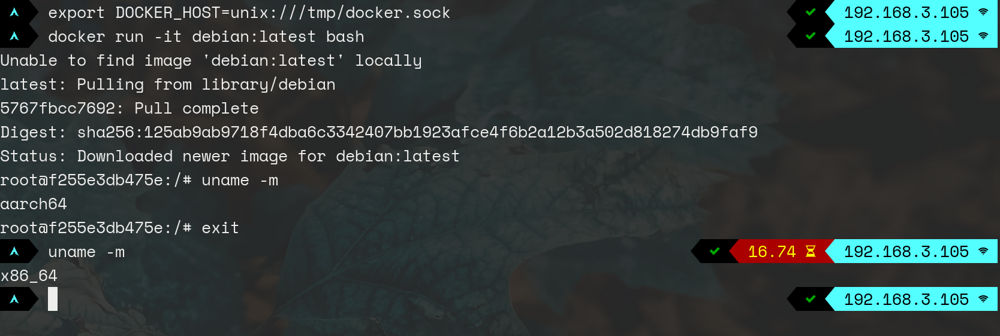

# Docker Platform-ify

Proxies the Docker API socket and injects a custom `platform` parameter
whenever an image is pulled/created.



## Warning

Industrial grade duct-tape!

 


## Usage

Since executables built for another architecture won't magically run on their
machine on your own, you're gonna have to install `qemu-user-static` and
ensure `binfmt_misc` is configured correctly, for example:

```
:qemu-aarch64:M::\x7fELF\x02\x01\x01\x00\x00\x00\x00\x00\x00\x00\x00\x00\x02\x00\xb7:\xff\xff\xff\xff\xff\xff\xff\x00\xff\xff\xff\xff\xff\xff\xff\xff\xfe\xff\xff:/usr/bin/qemu-aarch64-static:CF
```

Also, Docker needs to be started with the `--experimental` flag.

Note that this is equivalent to adding `--platform yourvalue` to the `docker pull`/
`docker run` commands, it just does it transparently. My use case is a CI runner
that connects to Docker using the API without the command line.

### Building

```bash
go build
```

### Running

```bash
./docker-platformify /var/run/docker.sock /tmp/injected.sock linux/arm64
```

### Change log level
```bash
./docker-platformify /var/run/docker.sock /tmp/injected.sock linux/arm64 DEBUG
```

## License

GNU GPLv3.0

Please share your changes if you end up deploying this piece of duct tape on
your premises :)


